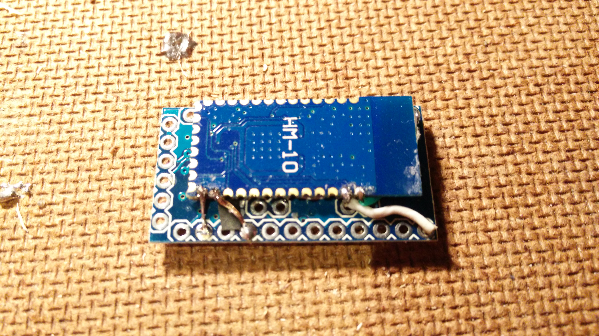
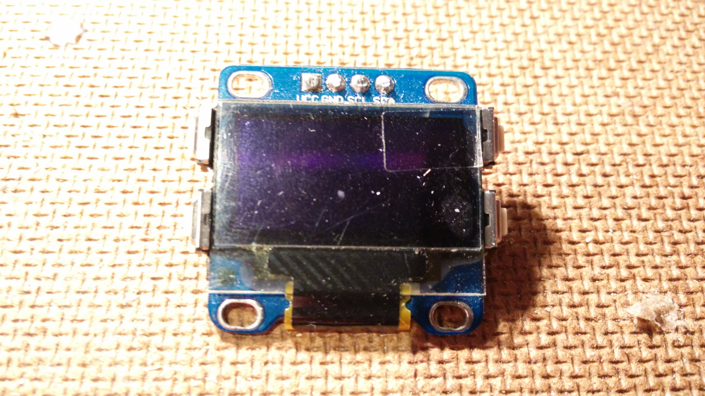
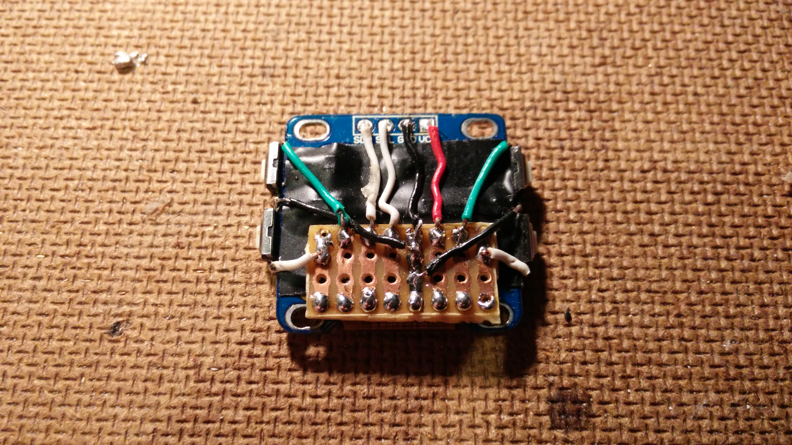
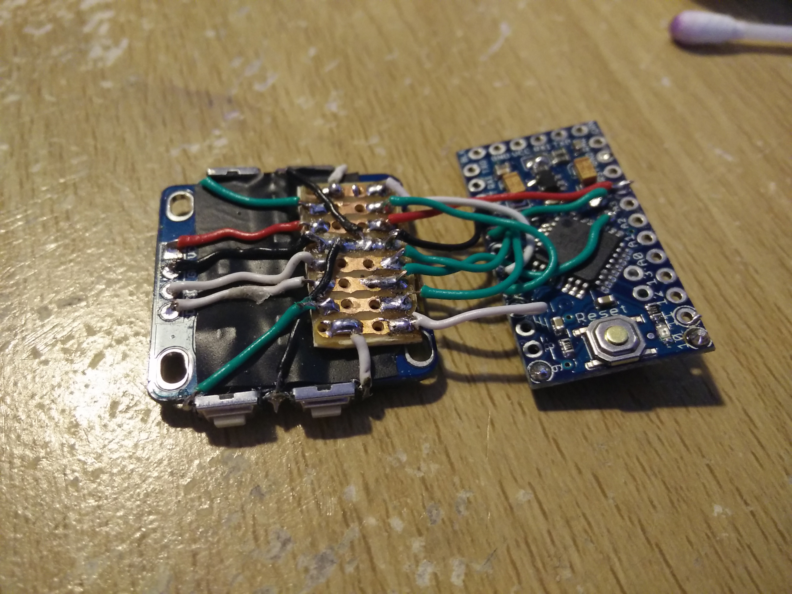
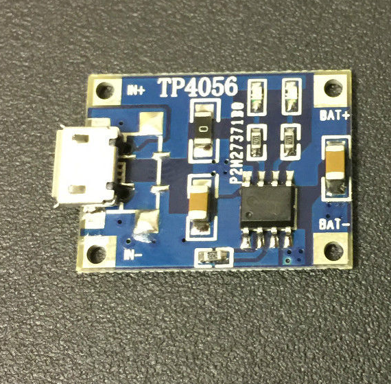
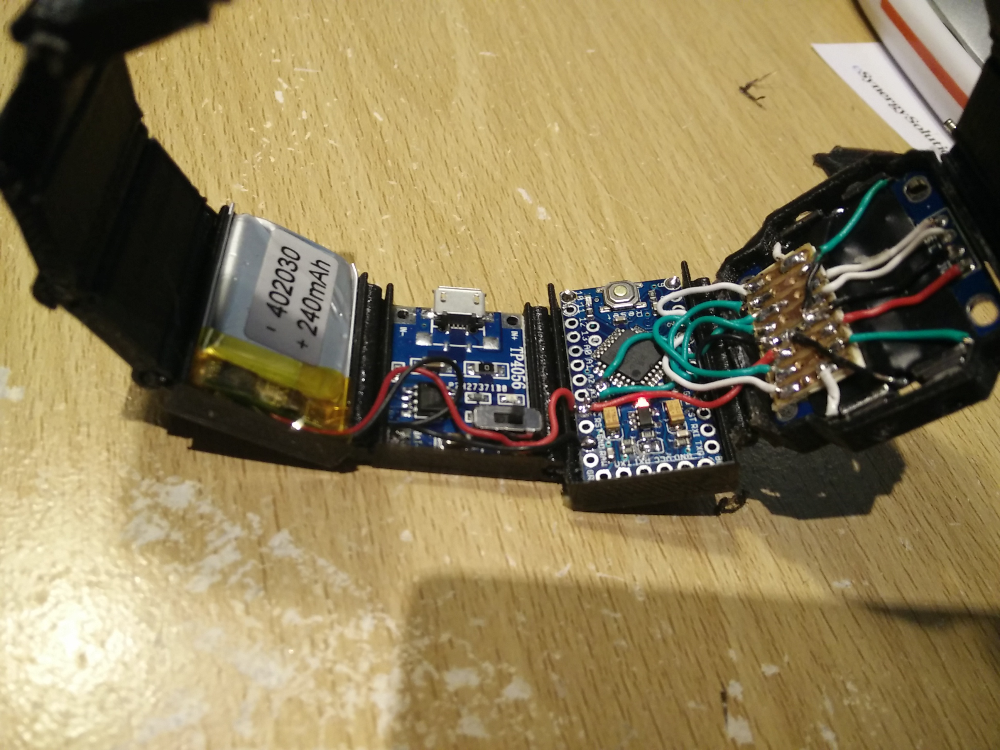

# How to make a WatchDuino 2

## Bill of materials

You'll need the following in order to build a WatchDuino 2:

- 1 × Arduino mini pro 2 8Mhz 3.3v
- 1 × FTDI USB to TTL serial adapter
- 1 × LIPO battery 240mah
- 1 × 0.96” I2C 128X64 OLED
- 4 × 3 x 6 x 4.3mm Push Button 2 Pin
- 1 × 0.06A Micro Vibrator Motor
- 1 × Bluetooth 4.0 BLE module HM-10
- 1 × Micro USB LIPO charger External charger (optional)

## Loading the WatchDuino firmware in the Arduino Mini

Before you even start building, it is advisable to load the WatchDuino
firmware into the Arduino Mini. You can also do this at the end, but if you do
it now you'll be able to try the components as you go along.

These are the steps you need to follow:

1. To install the firmware on a device you'll need the Arduino SDK and IDE.
You can download the latest bundle for your platform
[on the official website](https://www.arduino.cc/en/Main/Software),
for free. Unzip the package to any location of your choice. Remember this
location, because this will be the `Arduino SDK`, everytime we refer to it.
Open the `arduino` executable inside the SDK folder to run the IDE.

2. Copy all the folders inside the `libraries` folder in this repo into the
`libraries` folder of your Arduino SDK. These are dependencies the WatchDuino
code needs to compile.

3. On the Arduino IDE, click on `File->Open`. Navigate to where you cloned
the WatchDuino repository, and pick the `watch/watch.ino` file to open.
All of the WatchDuino files should now have been loaded in the IDE.

4. On the IDE now go to `Tools->Board` and pick `Arduino Pro or Pro Mini`.
Then pick `Processor:ATMega328 (3.3V, 8Mhz)`. This step is needed because the
IDE needs to know the microcontroller that we are using, in order to apply
the correct compilation options.

5. After all this, you should be able to compile the code. On the IDE, click
on the `Verify` button (the first icon in the toolbar, showing a tick). After a
minute it should be done without errors.

6. You are ready now to upload the code into your Arduino Mini. Plug the TTL
adapter module to your Arduino, and then connect it to your PC via USB.
Some LEDS on the Arduino should turn on.

7. Then go to `Tools->Port`, and you should
be able to see something in there (in my case it's '/dev/ttyUSB0', but this
will likely be different depending on your OS. It's essentially an identifier
for your USB port where your Arduino is plugged). If you see `Tools->Port`
greyed out, it's because you are not running the IDE with sufficient
permissions. If you are on Linux try running the program with a superuser
(eg. `sudo` on Ubuntu).

8. After that, click on the `Upload` button (the second icon in the toolbar,
showing a right pointing arrow). The Arduino Mini should now be loaded with
the WatchDuino firmware.

## Mounting a prototype on a breadboard

Before you go and build the real thing, it's advisable that you build a
prototype version on a breadboard. This way you can test that the code
is correctly loaded into the Arduino board, and that you understood
all the connections in the schematic right.

The schematic can be found in [the `schema` folder of this repo](../schema),
you should see an `.fzz` file in there. You can use the
[Fritzing software](http://fritzing.org/download/?donation=0) to open this
file, and it'll show you a detailed view of the components connected together,
which you can zoom and hightlight the connections in.

After you've successfully flashed the Arduino with the firmware, leave it
connected to the USB, and place it on the breadboard. Then:

- Place the buzzer. You should hear a "beep" if you reset the Arduino.
- Place the screen. You should see the WatchDuino interface if you reset
the Arduino.
- Place the buttons. You should be able to use them to navigate through
the menus.
- Place the bluetooth module. If your bluetooth module has any leds, you
should see of them blinking intermitently. This is because it hasn't
been paired yet. If you pair to the companion phone app it should become fixed.

## Soldering a wearable version

WIP!

Note: Before you assembly all these modules, it's highly recommended to test
them separately (for instance, by building the breadboard prototype first).

### Solder BLE and Arduino Mini together

We can solder the BLE module directly to the Arduino reverse to save some space.

You only need 4 pins here.

#### table
BLE Arduino
TX  D11
RX  D10
VCC 3.3
GND GND

## Glue the microbuttons to the screen

We need the buttons to be next to the screen, and the easiest way is to glue them.

### Solder the pins and the screen

The main objective now is to connect the Arduino+BLE to the Screen+Buttons.

To make this job easier, we soldered the screen and button pins to a middle PCB board.

#### table
PINS TODO

Reminder: The screen uses 2 analog pins (A4 and A5) which are in the middle of
the Arduino Mini board.

Once you finished, you can test the prototype by connecting the Arduino Mini
to your computer (by using the USB-TTL adaptor).

### Buzzer and Vibrator

Connect these two additional pieces to the following pins:

#### table
PINS TODO

### Battery and changer

This makes the watchduino portable, for our prototype we use a 240mah battery
and a LiPo USB charger, both connected to the VCC and GND pins on the Arduino

Optionally, you could remove the LiPo charger from the model, and keep 2 pins
to charge the battery using an external LiPo charger
(and sell it separately to become a millionarie, like the cool companies do).

### Enjoy your WatchDuino 2

Now you have a fully assembled WatchDuino 2, now get a case to keep all
the components and enjoy

